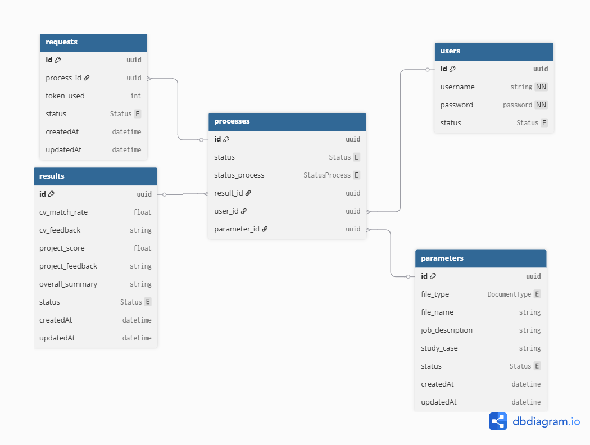

# Mini Project Rakamin Backend - CV Corrector/Evaluation API

This repository contains the backend API built with Node.js, Express, and MongoDB for the CV Corrector/Evaluation system. It manages user authentication, file uploads, configuration parameters, and the execution/retrieval of job processes.

## 🚀 1. Setup and Installation

Follow these steps to get the project running locally.

### 1.1 Prerequisites

Ensure you have the following installed on your machine:

* **Node.js**: v20 or later (you are using v24.5.0)

* **MongoDB**: Server version 4.4.16 or later

### 1.2 Installation

1. **Clone the repository:**
```bash
git clone [your-repo-url]
cd mini-project-rakamin-backend
```


2. **Install Dependencies:**
The project uses the following core dependencies, which include server utilities, authentication, file handling, and the necessary document parsing libraries:

* `express` (Server Framework)
* `mongoose` (MongoDB ORM)
* `dotenv` (Environment Variables)
* `jsonwebtoken` (JWTs for Authentication)
* `bcrypt` (Password Hashing)
* `multer` (File Uploads)
* `openai` (LLM Integration)
* `mammoth` (DOCX Parsing)
* `pdf-parse` (PDF Parsing)

Install all dependencies:
```bash
npm install
```


*(Dependencies are defined in your provided `package.json`.)*

### 1.3 Configuration (`.env`)

Create a file named **`.env`** in the root directory and define the following variables:

| Variable | Description | Example | 
 | ----- | ----- | ----- | 
| `NODE_ENV` | Application environment flag (e.g., for logging and error handling). | `local` (or `prod`) | 
| `PORT` | The port the Express server will run on. | `3000` | 
| `DB_NAME` | The name of the MongoDB database. | `cover_checker` | 
| `MONGODB_URI` | **MongoDB Connection String.** Use EITHER the local URI or the cluster URI. | `mongodb+srv://<username>:<password>@<clustername>.mongodb.net/` OR `mongodb://127.0.0.1:27017/cover_checker` | 
| `JWT_SECRET_KEY` | Secret key used for signing JWT tokens. **Must be long and random.** | `<YOUR_JWT_SECRET_KEY>` | 
| `OPENROUTER_API_KEY` | API Key for accessing the OpenRouter service. | `<YOUR_OPENROUTER_KEY_HERE>` |


### 1.4 Running the Server

Since the project uses TypeScript, use `ts-node` to execute the entry point (`src/server.ts`).

1. Ensure your MongoDB server is running.

2. Start the Express server:
```bash
npm start
```


The server will typically run on `http://localhost:{yourPort}

# 👤 User API Routes

The `/user` endpoint manages all user-related operations, including creation, retrieval, updating, and deletion of user accounts.

## Endpoint Overview

| Method     | Path             | Description                                         | Authentication                |
| :--------- | :--------------- | :-------------------------------------------------- | :---------------------------- |
| **POST**   | `/user/create`   | Creates a new user account.                         | None                          |
| **GET**    | `/user`          | Retrieves a paginated list of all users.            | **Required** (VerifyJWTToken) |
| **GET**    | `/user/:id`      | Retrieves a single user by their ID.                | None                          |
| **PATCH**  | `/user/edit/:id` | Updates a user's details (currently password only). | **Required** (VerifyJWTToken) |
| **DELETE** | `/user/:id`      | Deletes a user account by ID.                       | **Required** (VerifyJWTToken) |

## Detailed Route Documentation

### 1. Create User

**POST** `/user/create`

This route allows the creation of a new user account. No authentication is required for this endpoint.

| Parameter  | Type     | Location | Required | Description                               |
| :--------- | :------- | :------- | :------- | ----------------------------------------- |
| `username` | `string` | Body     | Yes      | The desired username for the new account. |
| `password` | `string` | Body     | Yes      | The user's password.                      |

**Controller Logic:**

- Extracts `username` and `password` from the request body.

- Calls `createUser({ username, password })` service.

- Returns the response status code and JSON payload from the service layer.

### 2. Get All Users

**GET** `/user`

Retrieves a list of all users. This route is protected and requires a valid JWT. Supports optional pagination parameters in the request body.

| Parameter | Type     | Location | Required | Default | Description                             |
| :-------- | :------- | :------- | :------- | :------ | :-------------------------------------- |
| `page`    | `number` | Body     | No       | `0`     | The page number for pagination.         |
| `limit`   | `number` | Body     | No       | `10`    | The number of users to return per page. |

**Middleware:**

- `VerifyJWTToken`: Ensures the user is authenticated.

**Controller Logic:**

- Parses optional `page` and `limit` from the request **body** (defaults to `0` and `10`).

- Calls `getAllUsers({ limit, page })` service.

- Returns the list of users, along with pagination information.

### 3. Get User by ID

**GET** `/user/:id`

Retrieves details for a specific user using their ID. No authentication is required for this endpoint.

| Parameter | Type     | Location  | Required | Description                     |
| :-------- | :------- | :-------- | :------- | ------------------------------- |
| `id`      | `string` | URL Param | Yes      | The ID of the user to retrieve. |

**Controller Logic:**

- Extracts `id` from URL parameters.

- Performs validation to ensure `id` is present.

- Calls `getUserById({ userId: id })` service.

- Returns the user data.

### 4. Update User

**PATCH** `/user/edit/:id`

Updates a specific user's account details. Currently configured to update the password only. Requires a valid JWT.

| Parameter  | Type     | Location  | Required | Description                    |
| :--------- | :------- | :-------- | :------- | ------------------------------ |
| `id`       | `string` | URL Param | Yes      | The ID of the user to update.  |
| `password` | `string` | Body      | Yes      | The new password for the user. |

**Middleware:**

- `VerifyJWTToken`: Ensures the user is authenticated.

**Controller Logic:**

- Extracts `id` from URL parameters and `password` from the request body.

- Performs validation on both `id` and `password`.

- Calls `updateUser({ id, password })` service.

- Returns the successful update response.

### 5. Delete User

**DELETE** `/user/:id`

Deletes a user account by their ID. Requires a valid JWT.

| Parameter | Type     | Location  | Required | Description                   |
| :-------- | :------- | :-------- | :------- | ----------------------------- |
| `id`      | `string` | URL Param | Yes      | The ID of the user to delete. |

**Middleware:**

- `VerifyJWTToken`: Ensures the user is authenticated.

**Controller Logic:**

- Extracts `id` from URL parameters.

- Performs validation to ensure `id` is present.

- Calls `deleteUser({ id })` service.

- Returns the successful deletion response.

# 🔑 Login API Routes

The `/login` endpoint handles user authentication, generating a necessary token for accessing protected resources. This route is mounted directly under the root path (`/`).

## Endpoint Overview

| Method   | Path     | Description                                       | Authentication |
| :------- | :------- | :------------------------------------------------ | :------------- |
| **POST** | `/login` | Authenticates a user and returns a session token. | None           |

## Detailed Route Documentation

### 1. User Login

**POST** `/login`

This route accepts user credentials and attempts to log the user in. If successful, it returns a token (e.g., JWT) that should be used for subsequent authenticated API calls.

| Parameter  | Type     | Location | Required | Description                   |
| :--------- | :------- | :------- | :------- | :---------------------------- |
| `username` | `string` | Body     | Yes      | The username of the account.  |
| `password` | `string` | Body     | Yes      | The password for the account. |

**Controller Logic:**

- Extracts `username` and `password` from the request body.

- Performs validation to ensure both `username` and `password` are present, returning a `422 Unprocessable Content` if either is missing.

- Calls the `login({ username, password })` service to handle authentication.

- Returns the response status code and the authentication result (e.g., token).

# 📁 File & Parameter API Routes

These routes handle file uploads, metadata creation, and parameter creation.

## 1. File Routes (Mounted at: `/`)

The `FileRouter` handles operations directly related to files, including uploading and deletion.

| Method   | Path      | Description                                                                 | Authentication                |
| :------- | :-------- | :-------------------------------------------------------------------------- | :---------------------------- |
| **POST** | `/create` | Creates a file-related entry or record (using `createParameterController`). | **Required** (VerifyJWTToken) |
| **POST** | `/upload` | Uploads a single file to the server.                                        | **Required** (VerifyJWTToken) |
| **POST** | `/remove` | Deletes a file record.                                                      | **Required** (VerifyJWTToken) |

### 1.1 Create File/Entry

**POST** `/create`

This route creates an entry, likely metadata or a placeholder record, before or after a file upload.

| Parameter         | Type     | Location | Required | Description                                                     |
| :---------------- | :------- | :------- | :------- | :-------------------------------------------------------------- |
| `file_name`       | `string` | Body     | Yes      | The name of the file associated with this entry.                |
| `file_type`       | `string` | Body     | Yes      | The type or category of the file (e.g., pdf,text, or docx). |
| `job_description` | `string` | Body     | Yes      | A description of the job or process this file relates to.       |
| `study_case`      | `string` | Body     | Yes      | The identifier for the study case or project.                   |

**Middleware:**

- `VerifyJWTToken`: Ensures the user is authenticated.

### 1.2 Upload File

**POST** `/upload`

This route handles the actual upload of a single file.

| Parameter | Type   | Location  | Required | Description                                                                  |
| :-------- | :----- | :-------- | :------- | :--------------------------------------------------------------------------- |
| `file`    | `file` | Form Data | Yes      | The file to be uploaded. Must be provided as a single file in the form data. |

**Middleware:**

1. `VerifyJWTToken`: Ensures the user is authenticated.

2. `upload.single('file')`: Handles multipart form data, specifically looking for a field named 'file'. Returns a `422 Unprocessable Content` if more than one file is provided.

**Controller Logic:**

- On successful middleware handling, `uploadFileController` is called to process the uploaded file.

### 1.3 Remove File

**POST** `/remove`

This route deletes a previously uploaded file or its associated record.

| Parameter   | Type     | Location | Required | Description                                |
| :---------- | :------- | :------- | :------- | :----------------------------------------- |
| `file_name` | `string` | Body     | Yes      | The unique name of the file to be deleted. |

**Middleware:**

- `VerifyJWTToken`: Ensures the user is authenticated.

**Controller Logic:**

- Extracts `file_name` from the request body.

- Calls `deleteFileController` service to handle the file removal using this name.

## 2. Parameter Routes (Mounted at: `/parameter`)

The `ParameterRouter` handles operations specifically for creating and managing configuration parameters.

| Method   | Path                | Description                     | Authentication                |
| :------- | :------------------ | :------------------------------ | :---------------------------- |
| **POST** | `/parameter/create` | Creates a new parameter record. | **Required** (VerifyJWTToken) |

### 2.1 Create Parameter

**POST** `/parameter/create`

This route creates a new record for application parameters using the same logic as the file entry creation.

| Parameter         | Type     | Location | Required | Description                                                     |
| :---------------- | :------- | :------- | :------- | :-------------------------------------------------------------- |
| `file_name`       | `string` | Body     | Yes      | The name of the file associated with this entry.                |
| `file_type`       | `string` | Body     | Yes      | The type or category of the file (pdf, docx, or txt). |
| `job_description` | `string` | Body     | Yes      | A description of the job or process this file relates to.       |
| `study_case`      | `string` | Body     | Yes      | The identifier for the study case or project.                   |

**Middleware:**

- `VerifyJWTToken`: Ensures the user is authenticated.

# ⚙️ Process API Routes

The `ProcessRouter` handles the execution of evaluation jobs and the retrieval of their results. This router is mounted under the root path (`/`).

## Endpoint Overview

| Method   | Path          | Description                                                     | Authentication                |
| :------- | :------------ | :-------------------------------------------------------------- | :---------------------------- |
| **POST** | `/evaluate`   | Starts a processing or evaluation job (e.g., CV evaluation).    | **Required** (VerifyJWTToken) |
| **GET**  | `/result/:id` | Retrieves the status and final result of a specific process ID. | **Required** (VerifyJWTToken) |

## Detailed Route Documentation

### 1. Start Evaluation Process

**POST** `/evaluate`

This route initiates a job (like CV evaluation) asynchronously. It requires a specific process ID to link the job to existing records (likely created via the File/Parameter routes).

| Parameter    | Type     | Location | Required | Description                                                           |
| :----------- | :------- | :------- | :------- | :-------------------------------------------------------------------- |
| `process_id` | `string` | Body     | Yes      | The ID identifying the process, job, or configuration to be executed. |

**Middleware:**

- `VerifyJWTToken`: Ensures the user is authenticated.

**Controller Logic:**

- Extracts `process_id` from the request body.
- Extracts `username` from the authenticated request object.
- Performs validation to ensure `process_id` is present.
- Calls `processCv({ process_id, username })` service to queue or start the evaluation job.
- Returns the status of the job initiation.

### 2. Get Process Result

**GET** `/result/:id`

This route retrieves the status and the final data output (result) for a specific process that has been started.

| Parameter | Type     | Location  | Required | Description                                                             |
| :-------- | :------- | :-------- | :------- | :---------------------------------------------------------------------- |
| `id`      | `string` | URL Param | Yes      | The ID of the running or completed process whose results are requested. |

**Middleware:**

- `VerifyJWTToken`: Ensures the user is authenticated.

**Controller Logic:**

- Extracts `id` from URL parameters.
- Performs validation to ensure `id` is present.
- Calls `getOneProcess({ process_id: id })` service.
- Returns a simplified response containing the process `id`, `status`, and the `data` (result).

# 🗃️ Database Schema Overview (ERD)

This document explains the core tables and relationships in the application's database schema, which supports user management, process configuration, job execution, and result storage.

## 0. Entity Relationship Diagram

**Visual Representation of the Data Model**



---

## 1. Core Entities

The schema revolves around five main tables:

| Table          | Purpose                                                                    | Connected API Routes           |
| -------------- | -------------------------------------------------------------------------- | ------------------------------ |
| **users**      | Stores user credentials for authentication.                                | `/user/*`, `/login`            |
| **parameters** | Stores configuration data and metadata used to start a process.            | `/create`, `/parameter/create` |
| **processes**  | The central execution record, linking the user, configuration, and result. | `/evaluate`, `/result/:id`     |
| **results**    | Stores the detailed, complex output data generated by an evaluation job.   | `/result/:id` (data source)    |
| **requests**   | Tracks resource usage, likely for rate limiting or token consumption.      | (Internal Tracking)            |

## 2. Table Details and Relationships

### 2.1 users

Manages user accounts.

| Field        | Data Type  | Notes                           |
| ------------ | ---------- | ------------------------------- |
| **id**       | `uuid`     | Primary Key (PK)                |
| **username** | `string`   | Not Null (NN)                   |
| **password** | `password` | Not Null (NN)                   |
| **status**   | `Status E` | Status Enum (active or deleted) |

**Relationship:** One **user** can initiate many **processes** (`processes.user_id`).

### 2.2 parameters

Stores the configuration or metadata required to define a job, such as file names and descriptions.

| Field               | Data Type        | Notes                           |
| ------------------- | ---------------- | ------------------------------- |
| **id**              | `uuid`           | Primary Key (PK)                |
| **file_type**       | `DocumentType E` | Enum: pdf, txt, docx            |
| **file_name**       | `string`         |                                 |
| **job_description** | `string`         |                                 |
| **study_case**      | `string`         |                                 |
| **status**          | `Status E`       | Status Enum (active or deleted) |
| **createdAt**       | `datetime`       |                                 |
| **updatedAt**       | `datetime`       |                                 |

**Relationship:** One **parameter** configuration can be used by many **processes** (`processes.parameter_id`).

### 2.3 processes (The Execution Link)

The central table that tracks the lifecycle of a single job.

| Field              | Data Type         | Notes                                                            |
| ------------------ | ----------------- | ---------------------------------------------------------------- |
| **id**             | `uuid`            | Primary Key (PK)                                                 |
| **user_id**        | `uuid`            | Foreign Key (FK) to `users`                                      |
| **parameter_id**   | `uuid`            | Foreign Key (FK) to `parameters`                                 |
| **result_id**      | `uuid`            | Foreign Key (FK) to `results`                                    |
| **status**         | `Status E`        | General Status Enum (active or deleted)                          |
| **status_process** | `StatusProcess E` | **Enum: success, processing, failed, queued, canceled, pending** |

**Relationships:**

- Links to **users** (M:1) and **parameters** (M:1).
- One **process** has one **result** (`results` table) and can generate many **requests** (`requests` table).

### 2.4 results

Stores the rich, detailed output of a completed job. This data is returned by the `GET /result/:id` endpoint.

| Field                | Data Type  | Notes                           |
| -------------------- | ---------- | ------------------------------- |
| **id**               | `uuid`     | Primary Key (PK)                |
| **cv_match_rate**    | `float`    |                                 |
| **cv_feedback**      | `string`   |                                 |
| **project_score**    | `float`    |                                 |
| **project_feedback** | `string`   |                                 |
| **overall_summary**  | `string`   |                                 |
| **status**           | `Status E` | Status Enum (active or deleted) |
| **createdAt**        | `datetime` |                                 |
| **updatedAt**        | `datetime` |                                 |

**Relationship:** One **result** belongs to one **process** (`processes.result_id`).

### 2.5 requests (Tracking/Logging)

Logs requests or resources consumed by a specific process run.

| Field          | Data Type  | Notes                           |
| -------------- | ---------- | ------------------------------- |
| **id**         | `uuid`     | Primary Key (PK)                |
| **process_id** | `uuid`     | Foreign Key (FK) to `processes` |
| **token_used** | `int`      | Quantity of resource consumed   |
| **status**     | `Status E` | Status Enum (active or deleted) |
| **createdAt**  | `datetime` |                                 |
| **updatedAt**  | `datetime` |                                 |

**Relationship:** One **process** can generate many **requests** (`requests.process_id`).

# 🗃️ Database Schema Overview (ERD)

This document explains the core tables and relationships in the application's database schema, which supports user management, process configuration, job execution, and result storage.

## 1. Core Entities

The schema revolves around five main tables:

| Table          | Purpose                                                                    | Connected API Routes           |
| -------------- | -------------------------------------------------------------------------- | ------------------------------ |
| **users**      | Stores user credentials for authentication.                                | `/user/*`, `/login`            |
| **parameters** | Stores configuration data and metadata used to start a process.            | `/create`, `/parameter/create` |
| **processes**  | The central execution record, linking the user, configuration, and result. | `/evaluate`, `/result/:id`     |
| **results**    | Stores the detailed, complex output data generated by an evaluation job.   | `/result/:id` (data source)    |
| **requests**   | Tracks resource usage, likely for rate limiting or token consumption.      | (Internal Tracking)            |

## 2. Table Details and Relationships

### 2.1 users

Manages user accounts.

| Field        | Data Type  | Notes                           |
| ------------ | ---------- | ------------------------------- |
| **id**       | `uuid`     | Primary Key (PK)                |
| **username** | `string`   | Not Null (NN)                   |
| **password** | `password` | Not Null (NN)                   |
| **status**   | `Status E` | Status Enum (active or deleted) |

**Relationship:** One **user** can initiate many **processes** (`processes.user_id`).

### 2.2 parameters

Stores the configuration or metadata required to define a job, such as file names and descriptions.

| Field               | Data Type        | Notes                           |
| ------------------- | ---------------- | ------------------------------- |
| **id**              | `uuid`           | Primary Key (PK)                |
| **file_type**       | `DocumentType E` | Enum: pdf, txt, docx            |
| **file_name**       | `string`         |                                 |
| **job_description** | `string`         |                                 |
| **study_case**      | `string`         |                                 |
| **status**          | `Status E`       | Status Enum (active or deleted) |
| **createdAt**       | `datetime`       |                                 |
| **updatedAt**       | `datetime`       |                                 |

**Relationship:** One **parameter** configuration can be used by many **processes** (`processes.parameter_id`).

### 2.3 processes (The Execution Link)

The central table that tracks the lifecycle of a single job.

| Field              | Data Type         | Notes                                                            |
| ------------------ | ----------------- | ---------------------------------------------------------------- |
| **id**             | `uuid`            | Primary Key (PK)                                                 |
| **user_id**        | `uuid`            | Foreign Key (FK) to `users`                                      |
| **parameter_id**   | `uuid`            | Foreign Key (FK) to `parameters`                                 |
| **result_id**      | `uuid`            | Foreign Key (FK) to `results`                                    |
| **status**         | `Status E`        | General Status Enum (active or deleted)                          |
| **status_process** | `StatusProcess E` | **Enum: success, processing, failed, queued, canceled, pending** |

**Relationships:**

- Links to **users** (M:1) and **parameters** (M:1).
- One **process** has one **result** (`results` table) and can generate many **requests** (`requests` table).

### 2.4 results

Stores the rich, detailed output of a completed job. This data is returned by the `GET /result/:id` endpoint.

| Field                | Data Type  | Notes                           |
| -------------------- | ---------- | ------------------------------- |
| **id**               | `uuid`     | Primary Key (PK)                |
| **cv_match_rate**    | `float`    |                                 |
| **cv_feedback**      | `string`   |                                 |
| **project_score**    | `float`    |                                 |
| **project_feedback** | `string`   |                                 |
| **overall_summary**  | `string`   |                                 |
| **status**           | `Status E` | Status Enum (active or deleted) |
| **createdAt**        | `datetime` |                                 |
| **updatedAt**        | `datetime` |                                 |

**Relationship:** One **result** belongs to one **process** (`processes.result_id`).

### 2.5 requests (Tracking/Logging)

Logs requests or resources consumed by a specific process run.

| Field          | Data Type  | Notes                           |
| -------------- | ---------- | ------------------------------- |
| **id**         | `uuid`     | Primary Key (PK)                |
| **process_id** | `uuid`     | Foreign Key (FK) to `processes` |
| **token_used** | `int`      | Quantity of resource consumed   |
| **status**     | `Status E` | Status Enum (active or deleted) |
| **createdAt**  | `datetime` |                                 |
| **updatedAt**  | `datetime` |                                 |

**Relationship:** One **process** can generate many **requests** (`requests.process_id`).
